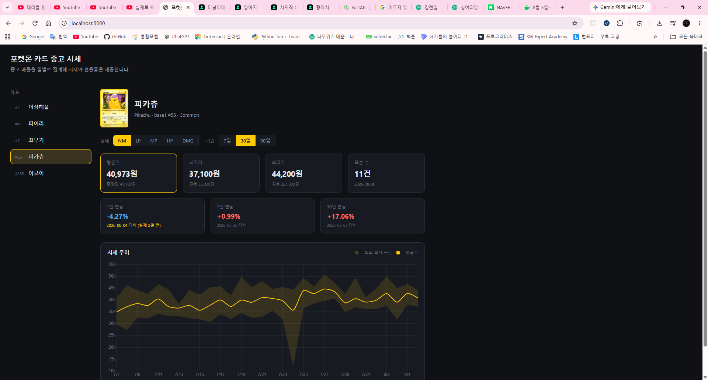

# 포켓몬 카드 중고 시세 API

카드별 중고 시세를 **최소가 / 최대가 / 평균가 / 중앙값**과 **기간별 변동률**로 제공하는 웹 서비스.

시범 대상 5종: 피카츄, 파이리, 꼬부기, 이상해풀, 이브이



---

## 기술 스택

| 구분 | 사용 기술 |
|---|---|
| 언어 | Python 3.13 |
| 프레임워크 | FastAPI |
| ORM | SQLAlchemy 2.0 (async) |
| DB | PostgreSQL 16 (Docker) |
| 드라이버 | asyncpg |
| 마이그레이션 | Alembic |
| 테스트 | pytest, pytest-asyncio |
| 프론트엔드 | Vanilla JS, Chart.js |
| 패키지 관리 | uv |

---

## 실행 방법

```bash
docker compose up -d                 # PostgreSQL 16 기동
uv sync                              # uv.lock 기준 의존성 설치
cp .env.example .env

uv run alembic upgrade head          # 스키마 생성
uv run python -m app.scripts.seed    # 더미 데이터 생성 및 집계

uv run uvicorn app.main:app --reload
```

| 주소 | 내용 |
|---|---|
| `http://localhost:8000` | 시세 조회 화면 |
| `http://localhost:8000/docs` | API 문서 (Swagger) |

```bash
uv run pytest                        # 27개 테스트
```

> 테스트는 `pokecard_test` 데이터베이스를 자동 생성해 사용하므로
> 개발용 데이터가 삭제되지 않는다.

---

## 프로젝트 구조

```
app/
├── core/config.py         설정 (.env, 이상치 절단 기준)
├── db/
│   ├── base.py            Declarative Base
│   └── session.py         비동기 엔진 / 세션
├── models/
│   ├── card.py            카드 마스터
│   └── price.py           매물 원본, 일별 집계
├── schemas/price.py       API 응답 스키마
├── services/
│   ├── aggregate.py       매물 → 일별 스냅샷 집계
│   └── price_query.py     조회 및 변동률 계산
├── api/v1/cards.py        엔드포인트
├── scripts/seed.py        개발용 더미 데이터
└── main.py                앱 진입점

static/
├── index.html
├── css/style.css
├── js/
│   ├── api.js             백엔드 응답을 아는 유일한 모듈
│   ├── chart.js           Chart.js 래핑
│   ├── viewer.js          카드 이미지 확대 (<dialog>)
│   └── app.js             화면 조립 및 상태 관리
└── vendor/                Chart.js (MIT)

tests/
├── conftest.py            테스트 DB 픽스처
├── test_price_query.py    변동률 단위 테스트 (15)
└── test_aggregate.py      집계 통합 테스트 (12)
```

---

## 데이터 모델

```
card ─┬─< listing         수집한 개별 매물 원본
      └─< price_snapshot  일별 집계 결과
```

### 설계 결정 1 — 원본과 집계의 분리

매물 원본(`listing`)과 일별 집계(`price_snapshot`)를 별도 테이블로 두었다.

조회 API는 `price_snapshot`만 읽으므로 매물이 수십만 건 쌓여도 조회 성능이 일정하다.
동시에 원본을 보존하므로 **이상치 판정 기준을 바꾼 뒤 전체 재집계가 가능하다.**
집계값만 저장하는 구조였다면 기준을 변경하는 순간 과거 데이터를 복구할 수 없다.

집계 함수는 멱등하게 작성해 배치 재실행과 과거 날짜 백필에 동일한 코드를 쓴다.

### 설계 결정 2 — 카드 상태 체계

같은 카드라도 상태에 따라 시세가 크게 달라지므로 상태를 구분하지 않은 평균값은 의미가 없다.

상태는 두 축으로 나뉜다.

- **미감정(raw)** — `NM / LP / MP / HP / DMG` (TCGPlayer 표준)
- **감정(graded)** — `PSA / BGS / CGC / SGC` 등급 1~10

이 둘은 가격대가 수 배에서 수십 배까지 차이 나는 사실상 다른 상품이므로 하나의 컬럼으로 합치지 않았다.
`condition` 또는 (`grader`, `grade`) 중 **정확히 하나만** 채워지도록 CHECK 제약으로 강제한다.

미감정 상태 체계로 TCGPlayer 표준을 채택한 이유는, 향후 연동할 외부 시세 API들이
공통적으로 이 체계로 데이터를 제공하기 때문이다. 초기에 맞춰두면 변환 계층이 불필요해진다.

실제 집계 결과에서 상태별 가격이 뚜렷한 계단을 이룬다.

| 상태 | NM | LP | MP | HP | DMG |
|---|---|---|---|---|---|
| 평균가 | 40,973 | 30,500 | 20,100 | 13,500 | 7,733 |

### 설계 결정 3 — NULL 처리

미감정 카드는 `grader`, `grade`가 NULL이다.
표준 SQL에서 NULL은 서로 같지 않은 값으로 취급되므로,
이로 인해 **정반대 방향의 문제가 두 곳에서 발생한다.**

**유니크 제약 — 막아야 할 것을 막지 못한다**

기본 UNIQUE 인덱스로는 동일한 카드·날짜·상태의 스냅샷이 몇 번이든 중복 삽입된다.
PostgreSQL 15부터 도입된 `NULLS NOT DISTINCT`로 해결했다.

```sql
CREATE UNIQUE INDEX ux_snapshot_variant_date ON price_snapshot
  (card_id, condition, grader, grade, snapshot_date) NULLS NOT DISTINCT;
```

**집계 조인 — 통과시켜야 할 것을 전부 버린다**

집계 SQL에서 `JOIN ... USING`이나 `=`를 쓰면 미감정 매물이 조인 결과에서 사라진다.
`IS NOT DISTINCT FROM`으로 조인해야 한다.

실제 데이터 9,555건으로 두 방식을 비교한 결과:

| 조인 방식 | 살아남은 행 |
|---|---|
| `IS NOT DISTINCT FROM` | 9,555 |
| `=` | **0** |

두 경우 모두 **오류가 발생하지 않고 조용히 잘못된 결과를 낸다.**
마이그레이션 적용 후 실제 INSERT로 제약 동작을 직접 검증한 이유다.

| 시나리오 | 기대 | 결과 |
|---|---|---|
| 동일 카드·날짜·NM 중복 삽입 | 차단 | `duplicate key value violates unique constraint` |
| `condition`과 `grader` 동시 입력 | 차단 | `violates check constraint` |
| 둘 다 미입력 | 차단 | `violates check constraint` |
| 동일 카드·날짜의 NM과 PSA 10 | 허용 | 정상 삽입 |

### 설계 결정 4 — 이상치 처리

중고 매물의 최저가에는 벌크 묶음이, 최고가에는 비정상 호가가 섞인다.
원시 최소·최대값을 그대로 노출하면 시세로서 의미를 갖지 못한다.

`percentile_cont`로 하위 5% ~ 상위 95% 구간을 잘라낸 값을 노출하고,
절단 이전 값은 별도 컬럼(`raw_min_price`, `raw_max_price`)에 보존해
필터 기준 조정의 근거로 사용한다.

피카츄 NM 기준 실측:

| | 최소 | 최대 | 배율 |
|---|---|---|---|
| 원본 | 6,000 | 429,700 | 71배 |
| p05~p95 절단 | 31,300 | 49,300 | **1.6배** |

절단 후에는 평균(39,589)과 중앙값(39,200)이 거의 일치한다.
절단 전이라면 평균이 극단값에 끌려 크게 왜곡된다.

표본이 8건 미만이면 절단이 오히려 왜곡이므로 건너뛴다.
평균과 함께 중앙값도 저장하며, 중고 시세에서는 중앙값이 더 안정적인 지표다.

> `percentile_cont`는 ordered-set aggregate라 `OVER (PARTITION BY)`로 쓸 수 없다.
> 따라서 경계를 먼저 구한 뒤 다시 조인하는 2단계 CTE 구조가 강제된다.

### 설계 결정 5 — 변동률의 빈 날짜 처리

수집 실패나 매물 부재로 특정 날짜의 스냅샷이 비는 상황은 반드시 발생한다.
정확히 N일 전 날짜를 조회하는 방식은 이 경우 값을 얻지 못한다.

기준일 이하의 가장 최근 스냅샷을 이분 탐색으로 찾는 방식으로 처리한다.
단, 대체 조회가 최신 스냅샷 자신을 반환하면 **변동률이 항상 0%로 표시되는 오류**가 발생하므로
이 경우를 명시적으로 배제한다.

응답의 `null`은 "변동 없음"이 아니라 **"비교 가능한 과거 데이터 없음"**이다.

또한 빈 날짜가 많으면 45일 전 스냅샷으로 "1일 변동률"이 계산되는 상황이 실제로 가능하다.
숫자만 내려주면 클라이언트가 이를 구분할 수 없으므로 **실제 참조한 기준 날짜를 함께 반환한다.**

```json
"day_1": { "rate": "-4.27", "base_date": "2026-08-04", "base_price": "42800.00" }
```

화면에서는 요청 기간과 실제 기준일이 어긋난 경우 `(실제 2일 전)`으로 강조 표시한다.

### 설계 결정 6 — 집계는 raw SQL

`percentile_cont` / `IS NOT DISTINCT FROM` / `ON CONFLICT`는 모두 PostgreSQL 고유 기능이고,
집계는 관계형 대수 그 자체라 ORM으로 감싸면 오히려 의도가 보이지 않는다.
이식성을 포기하는 대신 SQL 한 덩어리로 읽히게 했다. **조회 계층은 ORM을 그대로 사용한다.**

---

## API

### `GET /api/v1/cards`

카드 목록. 도감 번호 순.

### `GET /api/v1/cards/{card_id}/prices`

| 파라미터 | 기본값 | 설명 |
|---|---|---|
| `condition` | `NM` | 카드 상태 등급 |
| `period` | `30d` | `history`에 담을 기간 (`7d` / `30d` / `90d`) |

응답은 세 부분으로 구성한다.

- `current` — 최신 스냅샷 (절단값 + 원본값 + 표본 수)
- `change_rates` — 1일 / 7일 / 30일 변동률 + 각각의 기준 날짜
- `history` — 차트용 시계열

**조회 구간과 응답 구간은 다르다.**
30일 변동률을 계산하려면 30일 전 스냅샷이 필요하므로,
`period=7d` 요청에도 내부적으로는 30일 이상을 조회한다.
이를 맞추지 않으면 `period=7d`일 때 `day_30`이 항상 `null`이 된다.

---

## 프론트엔드

정적 파일을 FastAPI가 직접 서빙한다.
별도 서버로 띄우면 오리진이 달라져 CORS 설정이 필요하지만,
같은 오리진에서 제공하면 그 자체가 불필요해진다.

JS는 세 모듈로 분리했다.

| 모듈 | 책임 |
|---|---|
| `api.js` | 백엔드 응답 형태를 아는 유일한 곳 |
| `chart.js` | Chart.js 래핑 |
| `viewer.js` | 카드 이미지 확대 |
| `app.js` | 화면 조립과 상태 관리 |

응답 구조가 바뀌어도 `api.js`만 고치면 되도록 화면 로직과 분리했다.

차트 라이브러리는 CDN 대신 `static/vendor/`에 포함했다.
오프라인 환경과 CDN 장애에서도 동작하며, 원저작자 라이선스를 함께 둔다.

### 카드 이미지 확대

카드 상태(NM/LP 등)를 다루는 서비스인 만큼 카드를 크게 볼 수 있어야 한다.
pokemontcg.io는 파일명 뒤에 `_hires`를 붙인 고해상도 이미지를 함께 제공하므로,
목록에는 작은 이미지를, 확대 시에는 고해상도를 사용한다.

오버레이를 직접 구현하는 대신 HTML 표준 `<dialog>` 요소의 `showModal()`을 사용했다.
배경 딤 처리, ESC 키 닫기, 포커스 가두기, 접근성 속성이 모두 기본 동작으로 제공되므로
직접 다뤄야 할 것은 배경 클릭 판정과 이미지 교체뿐이다.

고해상도 이미지는 용량이 커서 즉시 표시되지 않는다.
먼저 작은 이미지를 띄우고 로딩이 끝나면 교체하며,
고해상도가 없는 카드를 대비해 실패 시 작은 이미지를 유지한다.

### 백엔드 설계가 화면에 드러나는 지점

- **변동률의 `null`** — "0%"가 아니라 "비교 데이터 없음"으로 표시하고 색을 달리한다
- **`base_date` 노출** — 요청 기간과 실제 비교 시점이 어긋나면 강조 표시한다
- **절단 전후 병기** — 원본 최대가가 절단값의 1.2배를 넘으면 원본값을 함께 보여준다
- **표본 부족 표시** — 표본 8건 미만인 날은 min–max 밴드를 그리지 않고 점만 찍는다

마지막 항목은 실제로 화면을 만든 뒤에야 드러난 문제였다.
표본이 부족한 날은 백엔드가 이상치 절단을 건너뛰므로 min/max에 극단값이 남고,
이를 그대로 그리면 **y축이 스파이크에 끌려가 정작 중요한 가격대가 납작하게 눌린다.**
해당 구간의 밴드를 끊어 축 범위를 정상화하면서,
동시에 "이 날은 신뢰도가 낮다"를 시각적으로 전달하도록 했다.

---

## 테스트 전략

```bash
uv run pytest    # 27 passed
```

| 계층 | 파일 | 개수 | DB 필요 |
|---|---|---|---|
| 순수 함수 | `test_price_query.py` | 15 | ✗ |
| 통합 | `test_aggregate.py` | 12 | ✓ |

변동률 계산은 DB에 의존하지 않는 순수 함수로 분리했다.
덕분에 스냅샷이 0건인 경우, 1건뿐인 경우, 평균가가 0인 경우처럼
**운영 데이터에서 우연히 발생하기를 기다릴 수 없는 경계 조건**을 직접 검증할 수 있다.

반면 집계는 mock으로 대체하지 않고 실제 PostgreSQL에 연결한다.
검증 대상인 퍼센타일 절단·NULL 조인·upsert 멱등성이 모두 DB 엔진의 동작이므로,
mock으로 감싸면 정작 확인하려던 것이 테스트에서 사라지기 때문이다.

운영 DB를 오염시키지 않도록 `pokecard_test`를 별도 생성하고,
각 테스트 전 `TRUNCATE ... RESTART IDENTITY CASCADE`로 격리한다.

> **async 테스트 이슈**
> session 스코프 엔진이 만든 커넥션을 function 스코프 테스트가
> 서로 다른 이벤트 루프에서 사용하면 asyncpg가
> `another operation is in progress`로 실패한다.
> `NullPool`로 매 작업마다 새 커넥션을 열어 해결했다.
> `asyncio_default_fixture_loop_scope`를 조정하는 방식은
> 픽스처와 테스트의 루프가 다시 어긋나 오히려 실패했다.

---

## 개발용 시드 데이터

```bash
uv run python -m app.scripts.seed
# 매물 9555건 삽입 (빈 날짜 15일)
# 스냅샷 1307건 생성
```

의도적으로 '지저분한' 데이터를 생성한다.
깨끗한 데이터로는 이상치 필터와 변동률 fallback이 동작하는지 검증할 수 없기 때문이다.

- 8% 확률로 하루치 매물을 통째로 비움 → fallback 경로 검증
- 3% 확률로 정상가의 15~30% (벌크 묶음) → 하한 절단 검증
- 2% 확률로 정상가의 4~12배 (과대 호가) → 상한 절단 검증

가격은 로그정규분포로 생성한다. 정규분포는 음수가 나올 수 있고,
실제 가격 분포도 오른쪽으로 꼬리가 긴 형태이기 때문이다.
난수 시드를 고정해 어느 환경에서든 동일한 데이터가 재현된다.

---

## 알려진 기술 부채

- **절단 임계값 중복** — `chart.js`의 `MIN_SAMPLES`가 백엔드 `min_samples_for_trimming`과
  수동으로 동기화되어 있다. 응답의 `PricePoint`에 절단 적용 여부를 담으면
  프론트가 임계값을 알 필요가 없어진다.
- **`set_code` 검증 부재** — 자유 문자열이라 오타를 막지 못한다.
  실제로 정글 세트를 `jungle`로 적어 이미지가 깨진 적이 있다(정답은 `base2`).
  외부 시세 API를 연동하면 조회 실패로 이어지므로 별도 테이블이나 Enum이 필요하다.

## 남은 작업

- [ ] 외부 시세 API 어댑터 (`source` 컬럼으로 출처 구분)
- [ ] 이상치 자동 탐지 → `listing.is_outlier` 마킹 배치
- [ ] 집계 배치 스케줄링
- [ ] 감정(graded) 카드 시세 노출
- [ ] 카드 간 시세 비교 화면

---

## 라이선스 및 출처

- 카드 이미지는 [pokemontcg.io](https://pokemontcg.io)의 URL을 참조하며 직접 호스팅하지 않는다.
- [Chart.js](https://www.chartjs.org) v4.5.1 (MIT) — `static/vendor/`
- 포켓몬 및 관련 상표는 Nintendo / Creatures Inc. / GAME FREAK inc.의 자산이다.
  본 프로젝트는 학습 목적의 비상업적 결과물이다.